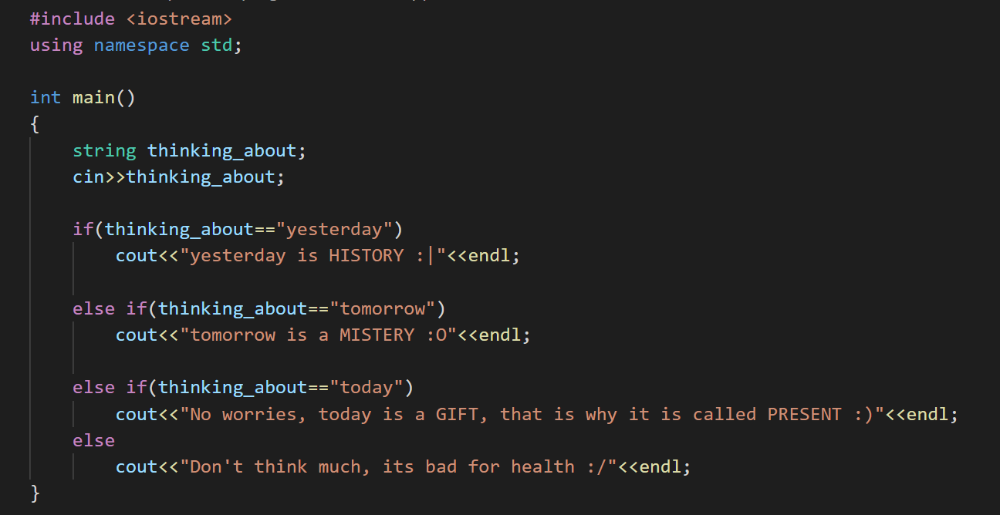

### Hi there, I am Adhyan!👋




- 🔭 I’m currently pursuing my **Bachelors** from **KIIT University** in **Electronics and Telecommunication Engineering**.
- 🌱 I’m currently learning **Data Science, Machine Learning** and **Deep Learning** Technologies.
- 💻 I’m looking for opportunities in **Software Engineering**, **Data Science** and **Machine Learning** domains.
- 🤝🏻 I'm open for collaborations in **Data Science** and **Machine Learning** domains.
- 🎯 Goal (2021): Contribute openly to **Data Science** and **Machine Learning** community.
- 📌 Scroll down to see my **Repositories**.

```python
def adhyan():
  skills = ['Python', 'C++', 'DSA', 'Machine Learning', 'Data Science', 'Deep learning', 'SQL']
  tools = ['numpy', 'pandas', 'sklearn', 'nltk', 'matplotlib', 'seaborn', 'keras', 'tensorflow', 'flask', 'MS Excel']
  cloud_architecture = ['heroku']
  open_source_contributer = True
  return ∞
```

### Reach out to me on :
- ⚡ Linkedin- https://www.linkedin.com/in/adhyanmaji/
- ⚡ Kaggle- https://www.kaggle.com/adhyanmaji31
- ⚡ Email- adhyan.maji@gmail.com
